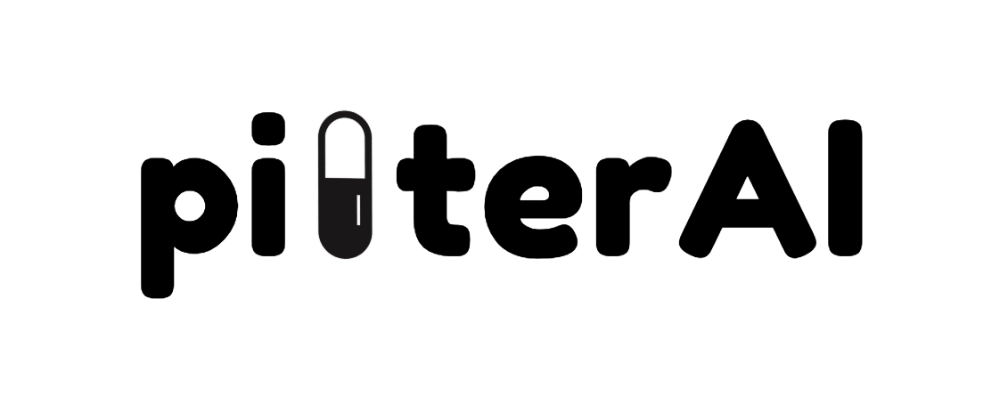
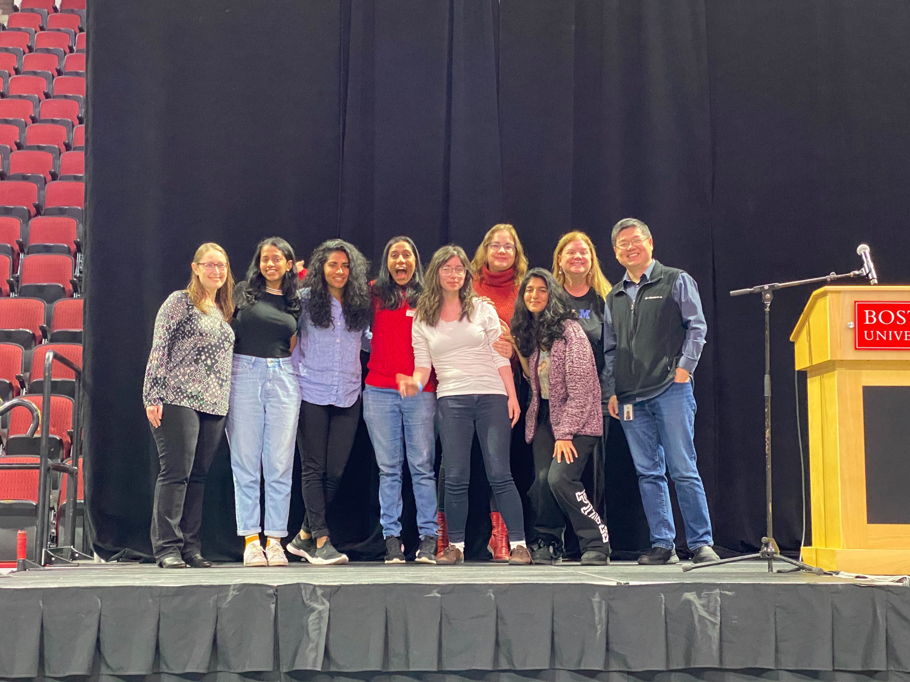
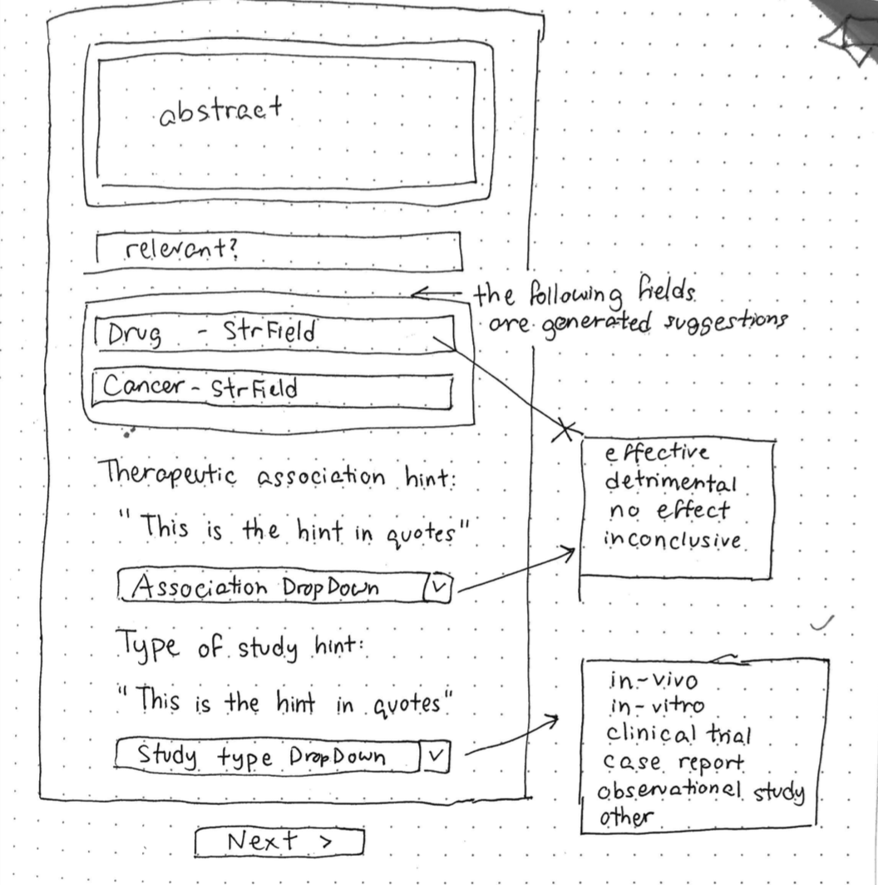
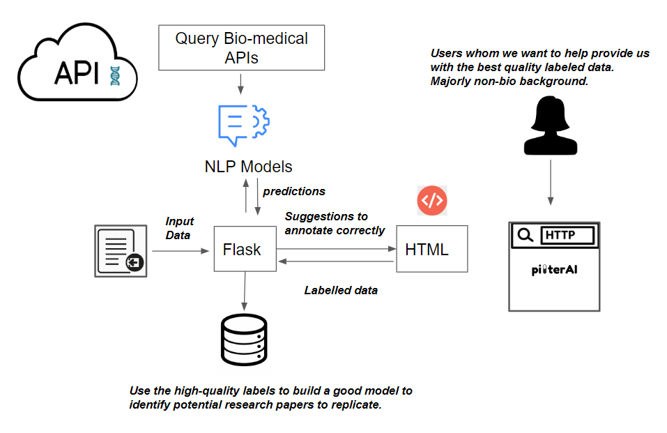

# IBM-research-challenge
TechTogether Boston 2020

## About
An NLP-powered, user-facing annotation tool to identify promising generic drugs for cancer treatment. 


## Developers and Researchers
* Ashvini Varatharaj [Worcester Polytechnic Institute]
* Anastasia Spangler [Bellevue College]
* Sejal Dua [Tufts University]
* [Smruthi Ramesh](https://github.com/smruthiramesh) [Northeastern University]
* Sulbha Aggarwal [Queens College (CUNY)]



## Introduction
There are many studies published on the utilization of generic drugs for cancer treatment. Analyzing this data is a huge challenge for automation, with little profit incentive, which is why Cures for Cancer within Reach is taking on this challenge.

Patients and their families are often eager to help with cancer research - and we'd like to help them feel empowered during an otherwise difficult period of time in their lives. With this in mind, we created a machine learning powered interface for annotating scientific abstracts. It uses suggestions to help guide a typical user -who may not have a biomedical background, through the annotation process.

This terrific impact is powered by an architecture relying on `AllenNLP` and `SciSpacy` for the bulk of the work - a question-answering model trained with ELMo provides excellent automatic annotations for cancer and drugs. `SciSpacy` is used as an added layer to increase the quality of our results.


## Design


## Summary of Methods
This project involves breaking down overwhelmingly technical text into information that can be used to identify promising cancer research directions. Therefore, when implementing the machine learning model to aid the user in labeling / annotating the data, our first priority was to create something that does not require for them to read the full abstract or parse through its complex biomedical jargon. We aimed to make it the user's sole job to evaluate and improve our machine learning model.

Since our simple development environment and a limited time-frame did not allow for machine learning models to be re-trained on the fly, we researched pre-trained models to see if we could query API(s) for our suggestive interface. 

The most promising tool at our disposal was [Allen NLP](https://demo.allennlp.org/reading-comprehension), which is an open-source NLP research library, built on PyTorch. They have a functionality called "Reading Comprehension." This deep learning tool allows for the input data to be in the form of question and the output data to be in the form of an answer (or answer choice in the case of multiple-choice questions). We used Allen NLP as an API that we direct queries to, and used the output from the pre-trained ELMo-BiDaF models as suggested answers for the user.

Our goal was to obtain the following four annotations from the user for any given abstract:
- Drug: What generic drug has been tested?
- Cancer: What type of cancer was it tested on?
- Therapeutic Association: How does the generic drug influence cancer? 
- Study Type: Which type of experiment was performed?

For each annotation category, we engineered the input and output specifications by testing which types of query strings return most accurate results when compared against the labeled data for this project. Below, we have provided a summary of how each model works in the context of our working demonstration.

### DRUG

```python
def find_drug_name(title):
```
`AllenNLP` input: title  
query string: *"What is the drug name?"*  
`AllenNLP` output: suggested drug name

### CANCER
```python
def identify_cancer(title, abstract):
```

`Spacy` input: title  
`Spacy` extracts any spans which might be an entity in UMLS, a large biomedical database.  
`Spacy` output: a list [x, y, z, ...] of title entities that may be of biomedical relevance  
query string: *"Of [x, y, z, ...] (biomedical terms that appear in the title), which is a cancer?"*  
`AllenNLP` input: abstract and query string  
`AllenNLP` output: suggested cancer type 

### THERAPEUTIC ASSOCIATION
```python
def association_hint(passage):
```

`AllenNLP` input: abstract  
query string: *"What was the impact of the drug on the cancer: effective, detrimental, no effect, or were the results inconclusive?"*  
`AllenNLP` output: hint for therapeutic association type, where the hint may be a subsection of the passage that contains the answer to the question, thus simplifying the task for the user

### STUDY TYPE
```python
def classify_study_type(text):
```
For this classification problem, we layered a heuristic model on top of the Allen NLP model in order to better gear the classifier to suit biomedical questions. When trying to discern whether the study was in-vivo or in-vitro, we looked at the frequency of words that strongly suggest what category the study might fall into. For in-vivo studies, the list of associated words was `[vivo, rats, rat, mouse, mice, animal]`. Due to lack of domain expertise, it was difficult to come up with a list of words that could indicate that the study is in vitro, so the only word that was counted was `[vitro`]. The firt heuristic we looked at was the frequency of the words related to each type of study. If the frequencies were some non-zero number to zero, the function should suggest to the user the study type with a non-zero number of occurrences in the abstract. Secondly, if the difference between the frequency of words related to one study type was greater than the frequency of words related to the other study type by 3 or more, the discrepancy was deemed distinct enough to suggest the study type with more related word incidinces. The threshold of 3 counts was chosen so that we would not mistakenly classify the document based on sentences about previous studies on the same drug, which proved to be a fairly common occurrence. In the event that the frequencies were both non-zero and comparable in magnitude, the abstract was fed into `AllenNLP`.

`AllenNLP` input: abstract  
query string: *"Is it vitro, vivo or both?"*  
`AllenNLP` output: either an answer matching *vitro*, *vivo* or *both* OR a subportion of the text that may help a human answer the question  
the function then extracts the `AllenNLP` output for the words *vitro* or *vivo* and returns the suggestion to the user

## Pipeline


## Languages, Packages, and Technologies
• **`Python`**: back end and Natural Language Processing

• **`Flask`**: integrate front end with back end

• **`Jupyter Notebook`**: testing, exploratory data analysis, and development

• **`sci-kit learn`**: training machine learning-based text classifiers

• **`Regex (regular expression)`**: clean data set, eliminating non-ASCII character set

• **`NLTK (Natural Language Toolkit)`**: text processing for classification models 

• **`HTML/CSS`**: UX/UI design

• **`Javascript / jquery`**: validations and dynamic elements in HTML/CSS 

• **`Heroku`**: hosting server

• **`AllenNLP`**: framework used for Natural Language processing

• **`Scispacy` / `spacy`**: used to extract biomedical terms and pre-process text for deep learning. 

## Bonus Challenge
* **Goal**: Use paper abstracts to classify them as directly relevant and non-relevant to cancer research
* **Preprocessing**: Cleaned up non-ascii characters resulting from footnotes and table links using regular expressions
* **Features**: Bag of words with stopwords removed (including domain relevant terms like measurements and acronyms)
  * Added part of speech tags onto the feature to provide more context
* **Values**: Word counts with a maximum per document limit to prevent common domain terms like "patient" that don't help with classification
  * Plan to move to tfIdf once there is more data
* **Models**: Logistic Regression and Support Vector Classifier trained with leave-one-out cross-validation due to small data size
* **Accuracy**: 73% for Logistic Regression and 74% for Support Vector Classifier
* **Interesting Indicators**:
  * Exclude: tolerated, safe
  * Include: demonstrated, potent, antitumor

## Usage
```
python start.py
```
NOTES:  
wait for local host IP and port to print to Terminal  
wait for debugger mode to become live  
then open up local host in browser

## The Model in Action


## Future Directions
* offer a text box for the user to paste a scientific abstract from PubMed
* include 3-5 suggestions for the user to select from instead of just 1
* if the hint is not relevant for therapeutic association, give the user the option to highlight relevant text and give their confidence
* color code the confidence values of network predictions 
* hover over biomedical jargon for simplified definition (e.g. apoptosis --> cell death)
* underline keywords to draw attention to themes that help inform the reader to answer the questions
* integrate saved responses with mongo DB database
* clean data better (e.g. filter out for artifacts and section titles like "BACKGROUND")
* be able to handle more complex therapeutic association classification than just binary (e.g. effective, no effect, inconclusive, detrimental)
* evaluate success of machine learning models with user input
* spend more time on bonus problem using neural net / `tdidf`
* use mongoDB for storing user input at large scalability

## Awards
IBM: Drug Repurposing for Cancer - A Data Driven Approach  
Dell Technologies: Best Hack for Driving Human Progress  

## Acknowledgments
Thank you to all the volunteers, mentors, sponsors, judges, and fellow hackers at TechTogether Boston 2020 for giving us inspiration and endless support. It was truly an incredible experience.
